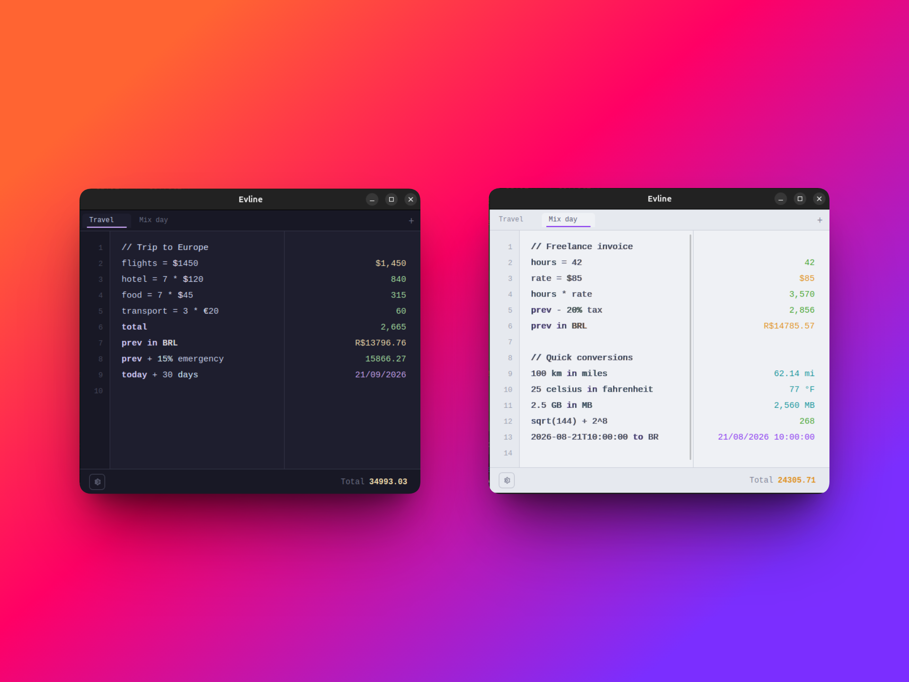
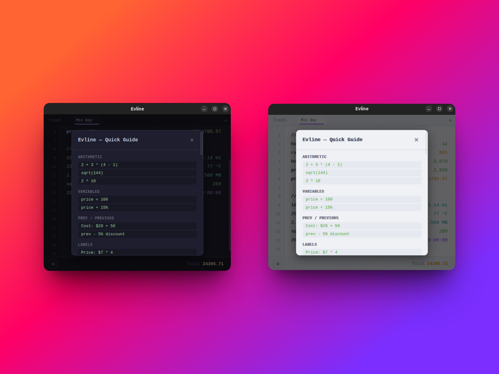

# Evline

### Stop wasting AI credits on simple math. Just type.

**[Leia em Português](./README.pt-br.md)**

---

Evline is a notepad-style calculator for Linux. Type expressions naturally — one per line — and see results instantly. No buttons, no equals sign, no context switching. The answer is always right there.



## Why Evline?

You don't need ChatGPT to split a bill. You don't need a spreadsheet to budget your month. You don't need to open a browser to convert currencies.

Evline replaces the mental gymnastics of "let me just quickly calculate..." with a scratchpad that **thinks as you type**.

```
rent = 1200
groceries = 450
transport = 180
sum                                  → 1,830
prev in USD                          → 328.00

trip budget:
flights = $1200
hotel = 5 * $89
food = 7 * $45
sum                                  → 2,060
prev in BRL                          → R$ 11,330.00
```

## Features



- **Natural language math** — `200 + 10%`, `$50 - 5% discount`, `8 times 9`
- **Bilingual engine** — understands English and Portuguese simultaneously
- **Live currency conversion** — `$100 in EUR`, `50 pounds em reais`
- **Unit conversion** — `10 km in miles`, `100 celsius in fahrenheit`
- **Variables** — `price = 100` then `price + 15%`
- **Totals** — `sum`, `average`, `prev`
- **Date arithmetic** — `today + 3 months`, `hoje + 17 dias`, `now` shows full datetime
- **Date format conversion** — `08/21/2026 to BR`, `21/08/2026 to ISO`
- **Multiple tabs** — drag to reorder, Ctrl+T to create, double-click to rename
- **Persistent state** — everything survives between sessions
- **Dark/Light theme** — Catppuccin Mocha and Latte
- **Syntax highlighting + autocomplete**
- **Undo/Redo** — Ctrl+Z / Ctrl+Y with full history
- **Click any result to copy**
- **Export** — Ctrl+S saves as `.txt`

## Keyboard shortcuts

| Shortcut | Action |
|----------|--------|
| Ctrl+T | New tab |
| Ctrl+W | Close tab |
| Ctrl+Shift+T | Reopen closed tab |
| Ctrl+Tab / Ctrl+Shift+Tab | Navigate tabs |
| Ctrl+1..9 | Jump to tab N |
| Ctrl+S | Export as .txt |
| Ctrl+Z | Undo |
| Ctrl+Y | Redo |

## Install

### Download (Debian/Ubuntu)

Grab the `.deb` from [Releases](https://github.com/fabriciosouza-dev/evline/releases):

```bash
sudo dpkg -i Evline_0.1.0_amd64.deb
```

### Build from source

```bash
# Prerequisites (Debian/Ubuntu)
sudo apt install libwebkit2gtk-4.1-dev build-essential curl wget file \
  libssl-dev libayatana-appindicator3-dev librsvg2-dev

# Build
git clone https://github.com/fabriciosouza-dev/evline.git
cd evline
npm install
npm run tauri build

# .deb output at src-tauri/target/release/bundle/deb/
```

**Development:**

```bash
npm run tauri dev
```

## Tech stack

| Layer | Tech |
|-------|------|
| Frontend | Svelte 5, Vite |
| Backend | Rust, Tauri 2 |
| Themes | Catppuccin Mocha / Latte |
| Persistence | `~/.evline/state.json` |

## Contributing

PRs welcome. Run `npm run tauri dev` to get started.

## License

MIT
